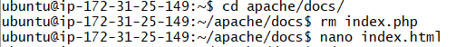
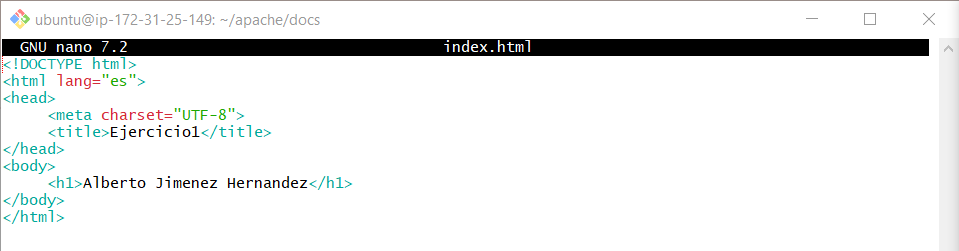
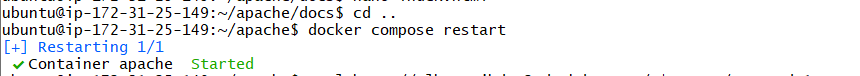
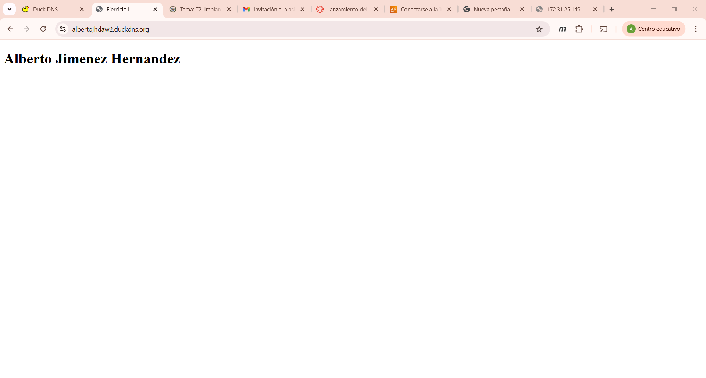
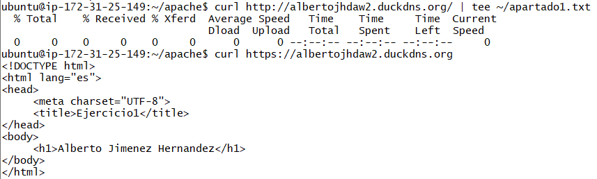
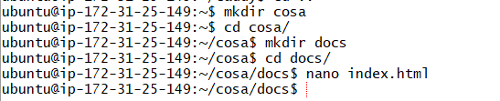
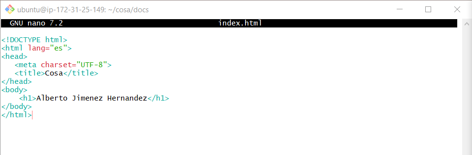
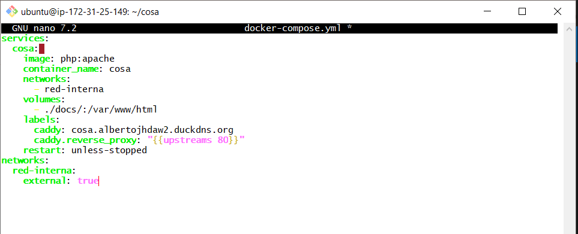
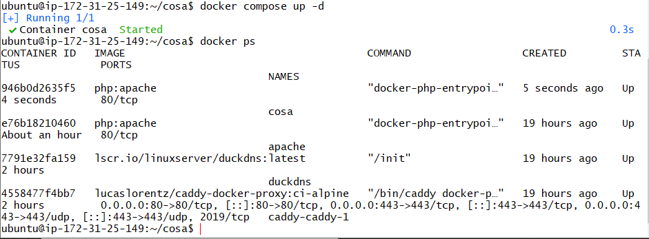
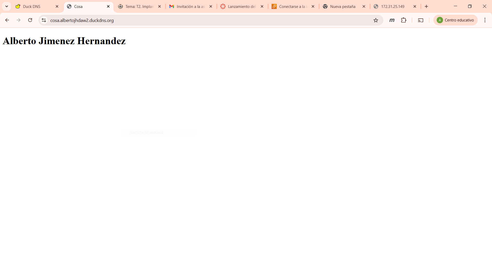

# Exame Despliegue Alberto Jimenez Hernandez

## Ejercicio 1 

### Instrucciones:
1. Nos vamos al directorio /apache/docs
2. Borramos el index.php que teniamos de los ejercicios de clase

3. Creamos un index.html con el siguiente contenido:

4. Nos volvemos al directorio apache con un cd ..
5. Hacemos un docker compose restart 

6. En el navegador buscamos en la url https://albertojhdaw2.duckdns.org y este seria el resultado:

7. Para verlo desde el el git bash en el laboratorio hacemos lo siguiente:

## Ejercicio 2

### Instrucciones:
1. Nos creamos un directorio llamado cosa y en el otro llamado docs

2. En el creamos un index.html cuyo contenido es el siguiente:

3. Creamos un docker-compose.yml con el siguiente contenido:

4. Levantamos el contendor y verificamos que este corriendo:

5. Metemos en nuestro navegador la URL https://cosa.albertojhdaw2.duckdns.org/ para ver si funciona:

6. Capturamos el resultado en la terminal y verificamos el archivo
![imagen](ej2/cap8.PN